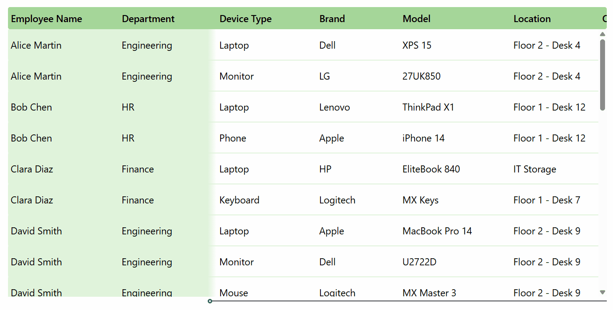

# Gallery with Horizontal Scroll

A gallery where the first two columns remain frozen while the user scrolls horizontally through additional columns using a slider. A gradient shadow visually separates the frozen columns from the scrollable area.

## Features

- Frozen columns that stay fixed during horizontal scroll
- Gradient shadow to visually separate frozen and scrollable columns
- Column widths and X positions driven by named formulas (`colColumnConfig`, `ColumnX`, `ColumnWidth`)
- Slider-controlled horizontal scroll
- Mock data pre-loaded in `OnVisible`, replace the `ClearCollect` with your own data source

## Authors

Snippet|Author(s)
--------|-------
Gallery with Horizontal Scroll | [Antanina Druzhkina](https://github.com/Ateina)

## Minimal path to awesome

1. Open your canvas app in **Power Apps**
1. Ensure the **User-defined functions** setting is turned on (located in the **Updates** section of the Settings menu)
1. Select the **App** element in the Tree View and navigate to its **Formulas** property
1. Paste the contents of **[gallery-horizontal-scroll.fx](./source/gallery-horizontal-scroll.fx)** into the Formulas property
1. Copy the contents of **[gallery-horizontal-scroll.yaml](./source/gallery-horizontal-scroll.yaml)**
1. Right click on the screen where you want to add the snippet and select **Paste Code**

## Code

- [gallery-horizontal-scroll.yaml](./source/gallery-horizontal-scroll.yaml)
- [gallery-horizontal-scroll.fx](./source/gallery-horizontal-scroll.fx)

## Disclaimer

**THIS CODE IS PROVIDED *AS IS* WITHOUT WARRANTY OF ANY KIND, EITHER EXPRESS OR IMPLIED, INCLUDING ANY IMPLIED WARRANTIES OF FITNESS FOR A PARTICULAR PURPOSE, MERCHANTABILITY, OR NON-INFRINGEMENT.**

